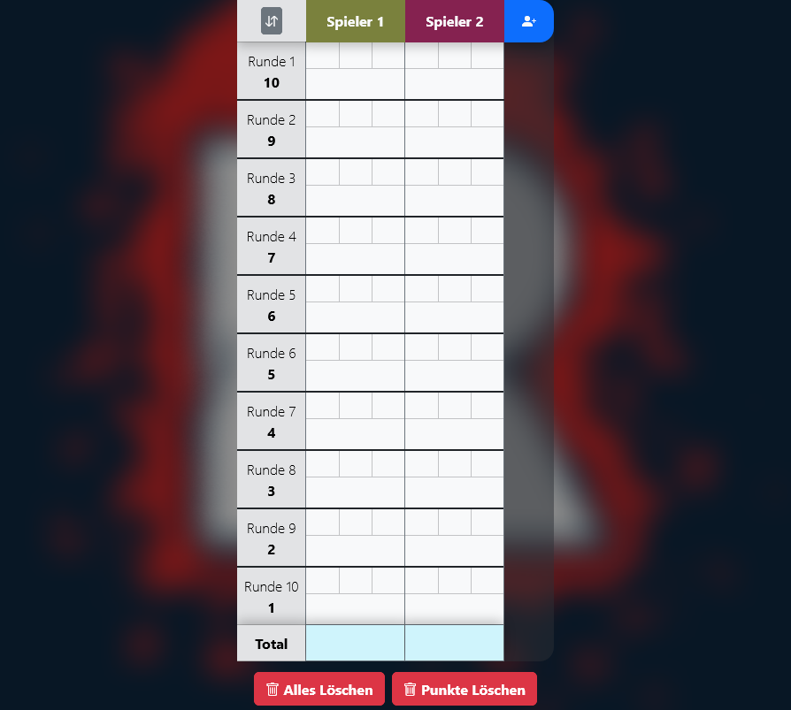
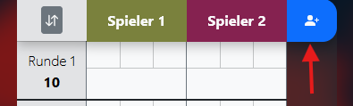
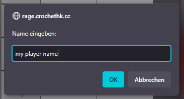
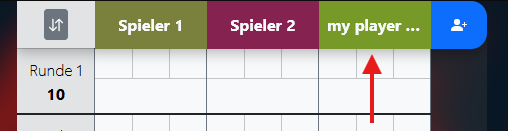
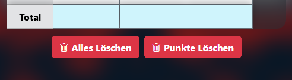
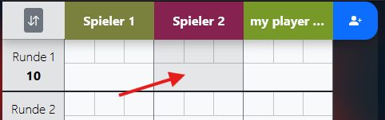
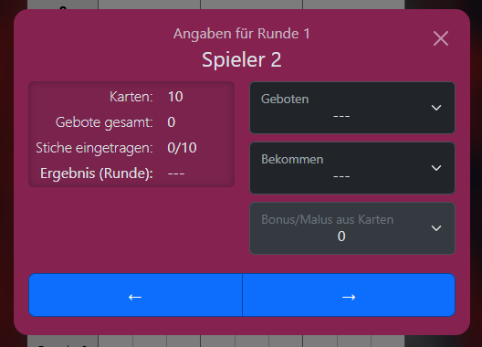

# Rage Card Game Score Tacker

A Webapp to conveniently track score of your [Rage (trick-taking card game)](<https://de.wikipedia.org/wiki/Rage_(Kartenspiel)>) parties, developed with Vite + React + TypeScript.

> Note that there are different versions of the game with slightly differing rules and decks. For instance, the english version's deck contains 2 "Bonus Rage" and 2 "Mad Rage" cards whereas in the german version there are 3 of each. This app covers mainly the german version.

## Usage

When you initially open the app you should see something similar to this:

From here you are ready to prepare and then start your _Rage_ game.

### Prepare the Game

#### Add a Player

The official rules require at least 3 players. You can add a player as follows:

- Click on the blue button on the right hand side of the table header row.

  

- A prompt will pop up to insert a name.

- Type the player's name and confirm.

  

- A new column with the player's name in the header will appear.

  > The new player's theme color is randomized.

  

#### Edit a Player

> Currently only changing a player's name is supported.

- In the table click on the name of the player you want to edit.
- A prompt will pop up with the current name.
- Edit the name as desired and confirm using the according button.

### Reset

In case you previously used the app, there might be old data present.
Currently there are two options two buttons to quickly reset it:

#### Clear points only

To clear all points but **preserve** current players click on the `Punkte Löschen` button.
This is useful if you want to start a new game with the same players.

#### Clear all data

> Currently this is the only way to remove a player.

To remove all points **and** players click on the `Alles Löschen` button.

### Score Input

During a game you will need to input _bids_, _tricks taken_ and where applicable the _bonus/malus_ resulting from cards of the taken tricks for each player.

- Click on a data cell in the row of the round in question to open the _Score Input Modal_

  

- A modal with a form to input score data should open.

  

- Select a select fields input the player's data relevant for the current game stage (e.g. the bid at the beginning of a round).

- Use the _arrow buttons_ at the bottom to quickly switch to the next or previous player.

- When done you can click on the backdrop or the `X`-button in the modal's top right corner.

### _(extra)_ Reverse Rounds Order

If after finishing a regular game you feel like playing another, you might want to 'spice things up' by playing in reverse rounds order.

To do this simply click on the `↓↑` button in the top left corner of the table.
