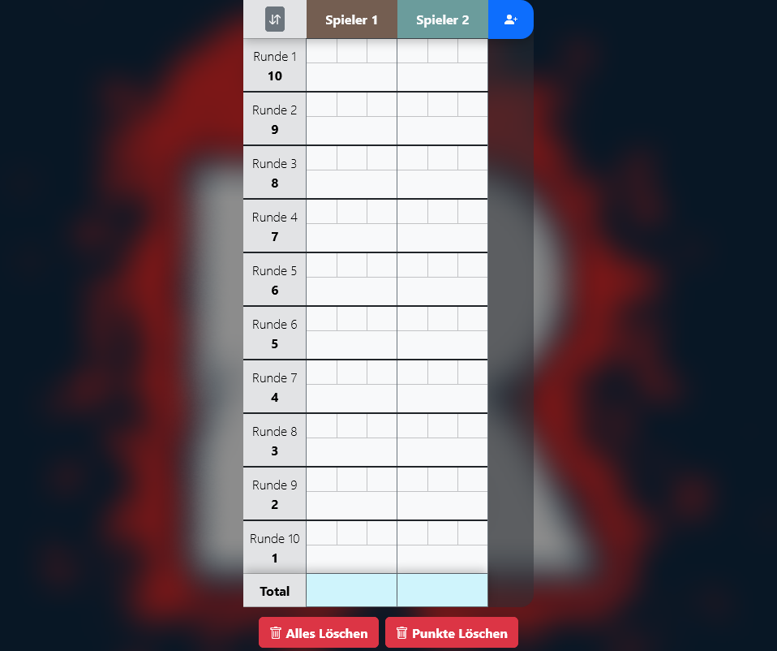
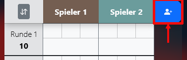
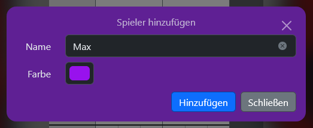
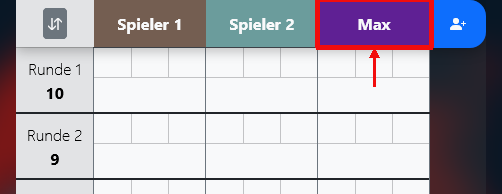
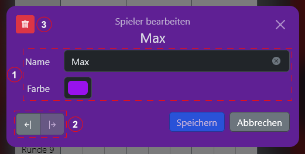
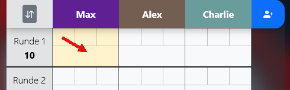
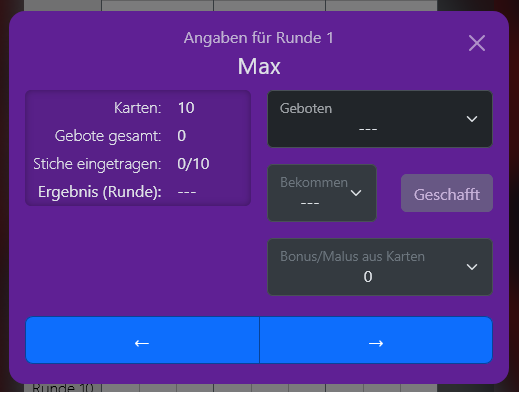
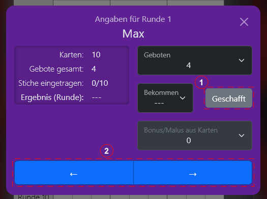
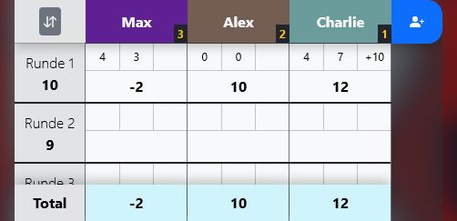
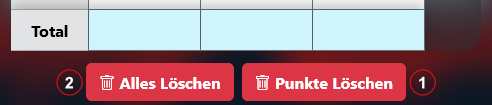

# Rage Card Game Score Tacker

A Webapp to conveniently track score of your [Rage (trick-taking card game)](<https://de.wikipedia.org/wiki/Rage_(Kartenspiel)>) parties, developed with Vite + React + TypeScript.

> Note that there are different versions of the game with slightly differing rules and decks. For instance, the english version's deck contains 2 "Bonus Rage" and 2 "Mad Rage" cards whereas in the german version there are 3 of each. This app covers mainly the german version.

## Usage

When you initially open the app you should see something similar to the image below:

From here you are ready to prepare and then start your _Rage_ game.

### Prepare the Game

#### Add a Player

> While technically you _could_ play the game with only two participants, the
> official rules require at least three players.

1. Click on the blue button on the right hand side of the table header row.

   

2. The _Add Player Dialog_ opens.

   

3. Insert the player's **name**.
   - (optional) Change the player's theme **color**.
     > The preselected color is randomly generated every time the modal is opened.

4. Click `Hinzufügen` to add the player.

   > The modal will then clear and remain open so you can add additional players.

5. For each new player a new accordingly named column will appear.

   

#### Edit a Player

1. Click on the name of the player you want to edit in the table header row.
2. The _Edit Player Dialog_ opens.

   

   Here you can:
   - (1) **Change** the player's _name_ and/or _color_.
   - (2) **Shift** the player's column to the right or left.
   - (3) **Remove** the selected player from the table.

3. To apply your changes click the `Speichern` button.

### Score Input

During a round you will need to input _bids_, _tricks taken_ for each player and where applicable the _bonus/penalty_ resulting from cards of the taken tricks.

1. Click on a player's data cell in the row of the round in question.

   

2. The _Score Input Dialog_ opens.

   

3. Using the drop-down fields, input the values relevant to the current game stage (e.g. the bid at the beginning of a round).

   
   - (1) **Set To Bid**: Use the `Geschafft` button to set _tricks taken_ to the player's _bid_ value.

   - (2) **←**/**→** : Use the _arrow buttons_ at the bottom to quickly switch to the next or previous player.

4. After a complete round the table will look similar to the image below:

   
   - Each cell shows the points received in a given round.
   - The total points of all rounds are shown at the bottom of the table.

### Reset

In case you previously used the app, there might be old data present.
Currently there are two buttons to quickly reset it:

- (1) **Clear points** _preserving_ current players by clicking on the `Punkte Löschen` button.
  This is useful if you want to start a new game with the same players.

- (2) **Clear all data** (points _and_ players) by clicking on the `Alles Löschen` button.

### _(extra)_ Reverse Rounds Order

If after finishing a regular game you feel like playing another, you might want to 'spice things up' by playing in reverse rounds order.

To do this simply click on the `↓↑` button in the top left corner of the table.
